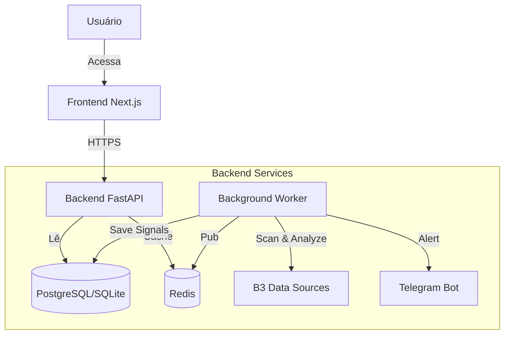

# 📚 B3 Options Signals - Wiki Content

Abaixo está o conteúdo sugerido para as páginas da sua Wiki no GitHub. Crie as páginas com os títulos sugeridos e cole o conteúdo correspondente.

---

## 🏠 Page: Home

# Bem-vindo ao B3 Options Signals

**B3 Options Signals** é uma plataforma de inteligência de mercado focada em identificar oportunidades em opções de ações brasileiras (B3). O sistema monitora o mercado em tempo real, aplica estratégias quantitativas e notifica traders via Dashboard e Telegram.

## 🚀 Principais Funcionalidades

*   **Scanner em Tempo Real:** Monitoramento contínuo das principais blue chips (PETR4, VALE3, BOVA11, etc.).
*   **Estratégias Quant:** Identificação automática de setups como IFR (RSI), Bandas de Bollinger e Volatilidade Implícita.
*   **Gestão de Risco:** Classificação automática de risco para cada operação (Seguro, Atenção, Arriscado).
*   **Alertas Multicanal:** Notificações instantâneas no Dashboard Web e via Bot no Telegram.

## 🔗 Links Rápidos

*   [[Instalação]] - Como rodar o projeto localmente.
*   [[Arquitetura]] - Como o sistema foi desenhado.
*   [[API]] - Documentação dos endpoints.
*   [[Deploy]] - Guia para produção.

---

## 🏗️ Page: Arquitetura

# Arquitetura do Sistema

O projeto adota uma arquitetura de microsserviços simplificada, separando claramente o motor de análise (Backend) da interface de usuário (Frontend).

## Diagrama (Mermaid)



## Stack Tecnológico

### Backend (`/b3-options-signals-py`)
*   **Linguagem:** Python 3.11+
*   **Framework Web:** FastAPI (Alta performance, Async)
*   **Agendamento:** APScheduler (Scans periódicos)
*   **Matemática Financeira:** NumPy, Pandas, Pandas-TA, Py_Vollib (Black-Scholes)
*   **Banco de Dados:** SQLAlchemy (ORM)

### Frontend (`/b3-options-signals-web`)
*   **Framework:** Next.js 14+ (App Router)
*   **UI Library:** TailwindCSS + Shadcn/ui
*   **Data Fetching:** SWR (Stale-While-Revalidate) para atualizações real-time.

---

## 💻 Page: Instalação

# Guia de Instalação Local

## Pré-requisitos
*   Docker & Docker Compose
*   Node.js 18+
*   Python 3.11+

## Passo a Passo

### 1. Clone o Repositório
```bash
git clone https://github.com/GabrielSalazar/options-signals.git
cd options-signals
```

### 2. Configuração do Backend
```bash
cd b3-options-signals-py
# Crie o ambiente virtual
python -m venv venv
source venv/bin/activate # ou venv\Scripts\activate no Windows

# Instale dependências
pip install -r requirements.txt

# Configure .env
cp .env.example .env
# Preencha TELEGRAM_BOT_TOKEN e outras variáveis
```

### 3. Configuração do Frontend
```bash
cd ../b3-options-signals-web
npm install

# Configure .env.local
echo "NEXT_PUBLIC_API_URL=http://localhost:8000" > .env.local
```

### 4. Rodando Tudo (Via Docker)
A maneira mais fácil é usar o Docker Compose na raiz:
```bash
docker-compose up --build
```
Acesse:
*   Frontend: `http://localhost:3000`
*   Swagger API: `http://localhost:8000/docs`

---

## ☁️ Page: Deploy

# Deploy em Produção

O projeto está configurado para deploy contínuo (CD).

## Backend (Render)
Hospedado via Docker Container.
*   **URL:** `https://options-signals-b79i.onrender.com` (Exemplo)
*   **Configuração:** Uso de Blueprint (`render.yaml`) ou Dockerfile multi-stage.
*   **Variáveis Críticas:**
    *   `PORT`: 8000
    *   `ALLOWED_ORIGINS`: URL do frontend (sem barra final).

## Frontend (Vercel)
Hospedado como aplicação Serverless Next.js.
*   **Configuração:** Importação direta do Git.
*   **Variáveis Críticas:**
    *   `NEXT_PUBLIC_API_URL`: URL do backend Render.

---

## 🔌 Page: API

# Referência da API

O Backend expõe uma API RESTful documentada via OpenAPI (Swagger).

## Endpoints Principais

### `GET /signals`
Retorna a lista de sinais de trading ativos filtrados por confiança.

**Parâmetros:**
*   `min_confidence` (int, default=60): Score mínimo de confiança.
*   `ativos` (list): Lista de tickers para filtrar (ex: PETR4, VALE3).

**Resposta Exemplo:**
```json
{
  "metadata": {
    "total_signals": 5,
    "timestamp": "2026-02-05T12:00:00"
  },
  "signals": [
    {
      "ticker": "PETR4",
      "strategy": "Trend Following",
      "signal_type": "BUY",
      "confidence_score": 85,
      "technicals": { "rsi": 32, "iv": 0.45 }
    }
  ]
}
```

### `GET /health`
Endpoint para verificação de status (usado pelo Render/K8s).
```json
{"status": "healthy"}
```
